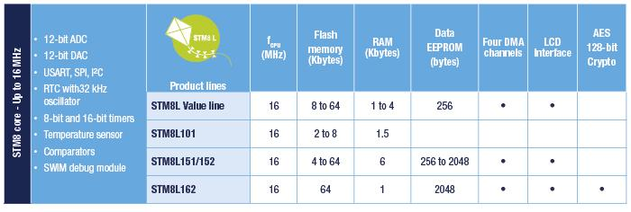

# [STM8L](https://github.com/sochub/STM8L) 
 
####  qitas@qitas.cn
#### 父级：[STM8](https://github.com/sochub/STM8) 
#### 近似：[MCS-51](https://github.com/sochub/MCS-51)

## [描述](https://github.com/sochub/STM8L/wiki) 

STM8L低功耗低成本单片机，拥有全面的产品线和各种规格

- Lowest power mode: 0.35 µA
- Dynamic run mode: 180 µA/MHz

 

### [资源收录](https://github.com/sochub/STM8L)

- [文档](docs/)
- [资源](src/)
- [工程](project/)

### [收录型号](https://github.com/sochub/STM8L)

- [STM8L0](https://github.com/sochub/STM8L0) 
- [STM8L10](https://github.com/sochub/STM8L10) 
- [STM8L15](https://github.com/sochub/STM8L15) 
- [STM8L16](https://github.com/sochub/STM8L16) 

### [替代方案](https://github.com/sochub/STM8L)

- [STM32L](https://github.com/sochub/STM32L)  
- [MSP430](https://github.com/sochub/MSP430) 

##  [SoC开发平台](http://www.qitas.cn)  

